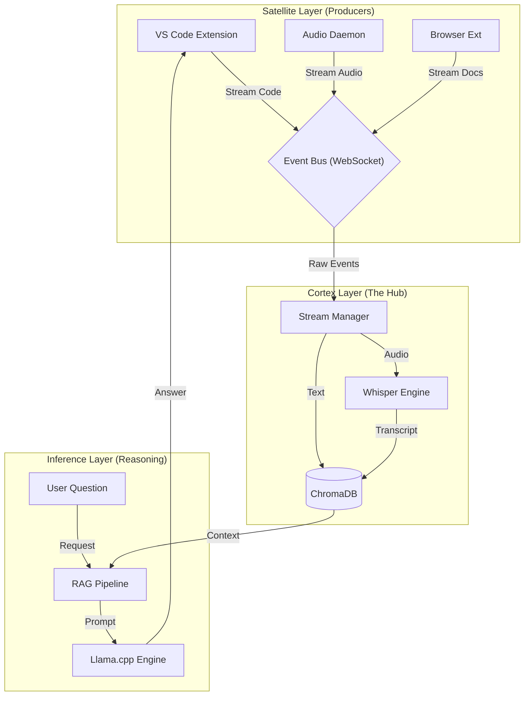

# OmniContext OS 🧠

> **The Unified Context Operating System for Developers.**
> *Evolution of the OmniAgentOS Project*

**OmniContext** is an open-source, local-first AI "Brain" that bridges the gap between your code, your meetings, and your research. It captures context from everywhere—your IDE, your system audio, and your browser—so you verify strictly on your machine.

---

## 📑 Table of Contents
1.  [Abstract & Vision](#-abstract--vision)
2.  [The Core Problem](#-the-core-problem)
3.  [The Solution](#-the-omnicontext-solution)
4.  [Technology Stack (High-Performance)](#-technology-stack-high-performance)
5.  [Architecture & Design](#-architecture--design)
6.  [Workflow Scenarios](#-workflow-scenarios)
7.  [Legacy History (V1)](#-legacy-history-omniagentos-v1)
8.  [Roadmap](#-roadmap)

---

## 🔭 Abstract & Vision

We are entering the era of **Contextual AI**. Your AI assistant is isolated in a browser tab or a specific application, unaware of the rich context of your entire workflow. **OmniContext** envisions a future where your AI is an **Operating System Service**, securely perceiving what you perceive (audio, code, text) to build a "Knowledge Graph" of your work.

---

## 💥 The Core Problem

Today's developer workflow is fragmented across "Context Silos":
1.  **Communication Silo (Zoom/Slack)**: Ephemeral decisions lost after the call.
2.  **Execution Silo (VS Code)**: Code that lacks business logic context.
3.  **Knowledge Silo (Browser)**: Research that is forgotten instantly.

**Result**: The user acts as the "Human Router", constantly copy-pasting text between these silos.

---

## 💡 The OmniContext Solution

We propose a **Hub-and-Spoke** architecture to break down these silos.
*   **The Hub ("Cortex")**: A local server acting as "Long-Term Memory".
*   **The Spokes ("Satellites")**: Background processes streaming data to the Hub.

---

## ⚡ Technology Stack (High-Performance)

We analyzed options (Python vs Rust vs Go) and selected the optimal stack for **Response Time** and **Memory Efficiency**.

### 1. The Nervous System: Python (FastAPI)
*   **Decision**: We chose **FastAPI** over Rust/Go.
*   **Why**: While Rust is faster at HTTP, the application bottleneck is Model Inference. Python allows Zero-Copy memory sharing with the ML engines, whereas Rust would require complex IPC, actually slowing down the system.

### 2. The Brain: Llama.cpp (via Python Bindings)
*   **Decision**: **Llama.cpp (GGUF Quantization)** over Standard Transformers.
*   **Why**:
    *   **Speed**: Written in optimized C++. Runs 4x faster on CPU/Apple Silicon.
    *   **Memory**: Uses 4-bit quantization. Run a 70B parameter model on a 24GB consumer GPU (impossible with standard transformers).

### 3. The Memory: ChromaDB
*   **Decision**: **ChromaDB (Embedded)** over Postgres.
*   **Why**: It runs *inside* the process. Zero network overhead for retrieval (<10ms).

---

## 🏗 Architecture & Design

The "Cortex" acts as the central router for all data streams.



---

## 🔄 Workflow Scenarios

### Workflow 1: The "Lazy" Meeting Implementation
*Scenario: You are in a Zoom call. The team decides to change the API authentication method.*

1.  **Capture**: `Satellite-Meet` detects voice. It streams audio to `Cortex`.
2.  **Process**: `Cortex` runs Whisper. It hears "Let's switch to JWT tokens".
3.  **Index**: This sentence is vectorized and tagged `#meeting` `#auth` `#jwt`.
4.  **Recall**: 2 hours later, you open `auth.py` in VS Code.
5.  **Action**: You ask the Chat: *"What did we decide about auth?"*
6.  **Response**: The AI pulls the exact sentence from 2 hours ago and says: *"The team decided to switch to JWT tokens. Shall I scaffold the JWT logic?"*

---

## 📂 Project Structure

This is how the **OmniContext** codebase is organized to support the Hub-and-Spoke architecture.

```mermaid
graph TD
    Root[OmniContext]
    
    subgraph Backend [backend/cortex]
        Core[core<br/>(Config, Logs)]
        Events[events<br/>(Bus, WebSockets)]
        Memory[memory<br/>(ChromaDB)]
        Models[models<br/>(Llama.cpp, Whisper)]
    end
    
    subgraph Satellites
        Code[satellite-code<br/>(VS Code)]
        Meet[satellite-meet<br/>(Python/Desktop)]
    end
    
    Root --> Backend
    Root --> Satellites
```

```text
OmniContext/
├── backend/
│   ├── cortex/                     # The "Brain" Application
│   │   ├── __init__.py
│   │   ├── main.py                 # FastAPI App & Entry Point
│   │   ├── core/
│   │   │   ├── __init__.py
│   │   │   ├── config.py           # Envs, Path constants (Data Dir)
│   │   │   └── logging.py          # Structured Logger
│   │   ├── events/
│   │   │   ├── __init__.py
│   │   │   ├── bus.py              # WebSocket Connection Manager
│   │   │   └── protocol.py         # Pydantic Schemas (AudioEvent, CodeEvent)
│   │   ├── memory/
│   │   │   ├── __init__.py
│   │   │   ├── vector_store.py     # ChromaDB Wrapper (Insert/Query)
│   │   │   └── retrieval.py        # Logic for RAG & Time-decay search
│   │   ├── models/
│   │   │   ├── __init__.py
│   │   │   ├── llm.py              # Llama.cpp Engine Wrapper
│   │   │   └── transcription.py    # Whisper Streaming Logic
│   │   └── api/
│   │       ├── __init__.py
│   │       ├── websocket.py        # /ws/stream endpoint
│   │       └── routes.py           # Standard REST (Health, Config)
│   ├── data/                       # IGNORED BY GIT
│   │   ├── chroma/                 # VectorDB Persistence
│   │   └── uploads/                # Temp audio chunks
│   └── requirements.txt            # fastpi, uvicorn, websockets, chromadb...
├── satellites/
│   ├── code/                       # VS Code Extension
│   │   ├── package.json
│   │   └── src/
│   │       ├── extension.ts        # Activator
│   │       └── client.ts           # WebSocket Client
│   ├── meet/                       # Desktop Daemon
│   │   ├── main.py                 # System Tray Entry
│   │   └── audio_capture.py        # PyAudio Loopback
│   └── web/                        # Chrome Extension
│       └── manifest.json
└── README.md
```


### Workflow 2: The "Context-Aware" Bug Fix
*Scenario: You are reading a StackOverflow article about a specific error.*

1.  **Capture**: `Satellite-Web` scrapes the StackOverflow solution required to fix your bug.
2.  **Index**: `Cortex` stores the solution strategy.
3.  **Action**: You switch to VS Code and highlight the error.
4.  **Suggestion**: Cortex Proactively suggests: *"Based on the page you just viewed, you should wrap this in a try/catch block like this..."*

---

## 🔒 Security & Privacy Manifesto

**"Your Context is Your IP."**
1.  **Local-First / Local-Only**: OmniContext sends **ZERO** data to the cloud.
2.  **Air-Gapped Capable**: You can unplug your internet cable, and OmniContext will still function.

---

## 📜 Legacy History: OmniAgentOS (V1)

**OmniAgentOS (V1)** was our proof-of-concept. It used a simple REST API and standard Transformers.
*   **Limitation**: It was "Reactive" and stateless.
*   **Improvements in V2**: Moved to WebSockets for real-time streams and Llama.cpp for performance.

---

## 🗺 Roadmap

*   **Phase 1: Cortex Foundation** (Current)
    *   [ ] Event Bus Implementation.
    *   [ ] ChromaDB Integration.
    *   [ ] Streaming Whisper Pipeline.
*   **Phase 2: VS Code Satellite**
    *   [ ] Sidebar Chat UI.
    *   [ ] "Active File" Watcher.
*   **Phase 3: Audio Satellite**
    *   [ ] System Audio Capture.
    *   [ ] Voice Activity Detection.

---
*Built with ❤️ by the Open Source Community*
